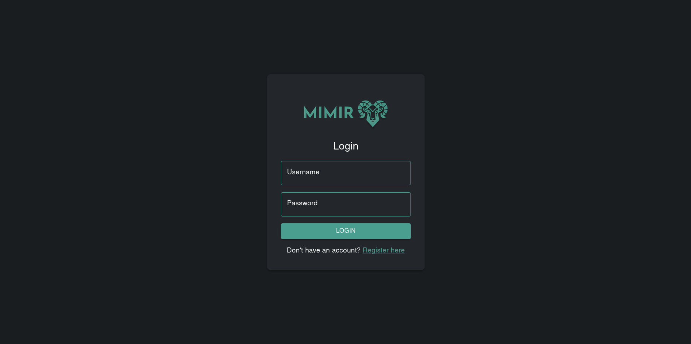
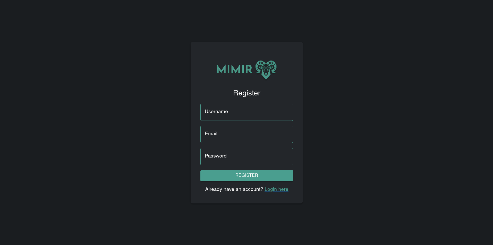
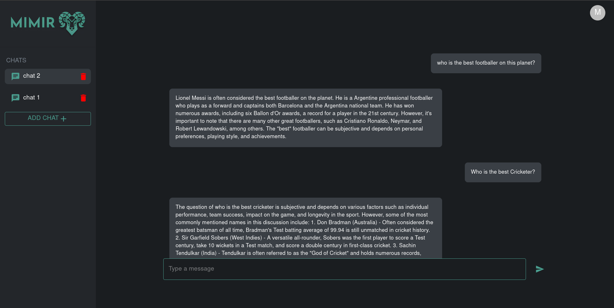

# MIMIR - LLM Chatbot

Mimir is an LLM chatbot made using the Mistral-7B-Instruct-v0.3 model for inference.
It is an open source chat model based on the Mistral-7B architecture having 7.25B params.
Mistral-7B-Instruct-v0.3 offers a high degree of versatility and performance for many real-world applications, providing a strong alternative for those needing a lightweight yet powerful instruction-following model.

<!--  -->

# Technology

- Django - server side logic.
- React.Js - UI and client side functionality.
- MUI - React Components Library
- Mistral-7B-Instruct-v0.3 from HuggingfaceHub.

